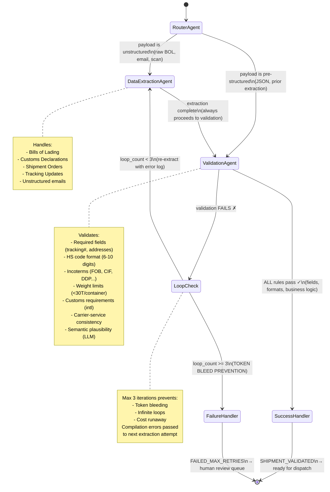

# State Machine Diagram

```mermaid
stateDiagram-v2
    [*] --> RouterAgent
    
    RouterAgent --> DataExtractionAgent : payload is unstructured\n(raw BOL, email, scan)
    RouterAgent --> ValidationAgent : payload is pre-structured\n(JSON, prior extraction)
    
    DataExtractionAgent --> ValidationAgent : extraction complete\n(always proceeds to validation)
    
    ValidationAgent --> SuccessHandler : ALL rules pass ✓\n(fields, formats, business logic)
    ValidationAgent --> LoopCheck : validation FAILS ✗
    
    LoopCheck --> DataExtractionAgent : loop_count < 3\n(re-extract with error log)
    LoopCheck --> FailureHandler : loop_count >= 3\n(TOKEN BLEED PREVENTION)
    
    SuccessHandler --> [*] : SHIPMENT_VALIDATED\n→ ready for dispatch
    FailureHandler --> [*] : FAILED_MAX_RETRIES\n→ human review queue

    note right of LoopCheck
        Max 3 iterations prevents:
        - Token bleeding
        - Infinite loops
        - Cost runaway
        Compilation errors passed 
        to next extraction attempt
    end note
    
    note right of DataExtractionAgent
        Handles:
        - Bills of Lading
        - Customs Declarations
        - Shipment Orders
        - Tracking Updates
        - Unstructured emails
    end note
    
    note right of ValidationAgent
        Validates:
        - Required fields (tracking#, addresses)
        - HS code format (6-10 digits)
        - Incoterms (FOB, CIF, DDP...)
        - Weight limits (<30T/container)
        - Customs requirements (intl)
        - Carrier-service consistency
        - Semantic plausibility (LLM)
    end note
```
